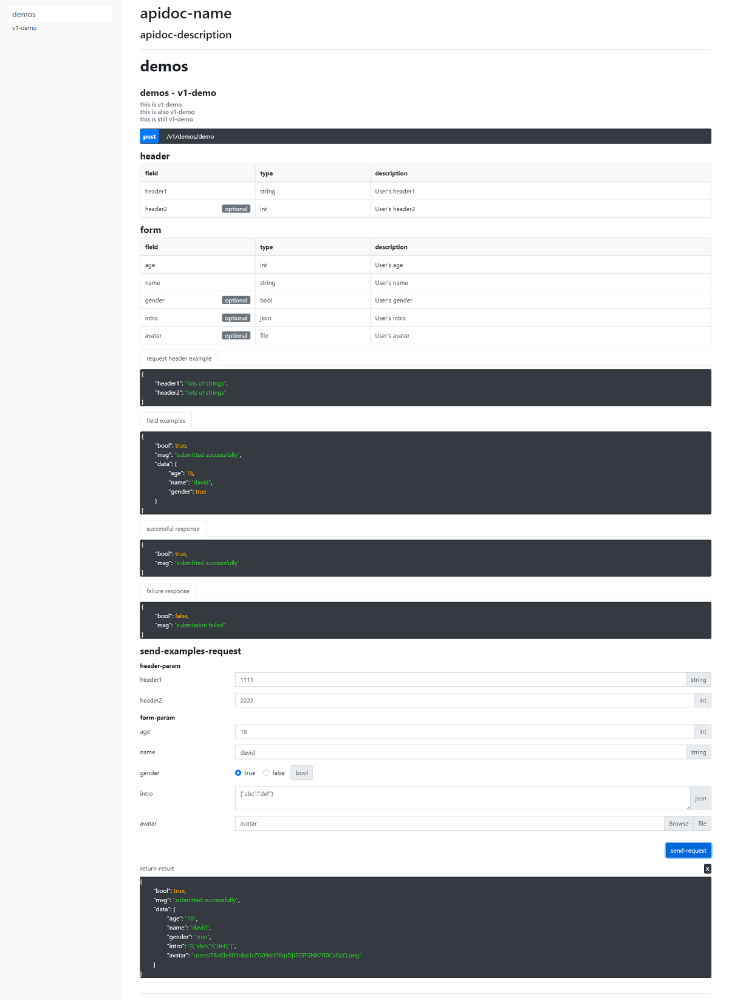

- effect



- example of effect

```php
<?php
namespace App\Http\Controllers\V1;

use App\Http\Controllers\Controller;
use Illuminate\Http\Request;

class DemoController extends Controller
{
    /**
     * @apiVersion 1.0.1
     * @apiGroup demos
     * @apiName v1-demos-demo
     * @api {post} /v1/demos/demo v1-demo
     * @apiDescription this is v1-demo
     *
     * this is also v1-demo
     *
     * this is still v1-demo
     *
     * @apiHeader {string} header1 User's header1
     * @apiHeader {int} [header2] User's header2
     * @apiHeaderExample request header example:
     * {
     *   "header1":"lots of strings",
     *   "header2":"lots of strings"
     * }
     * @apiParam {int} age User's age
     * @apiParam {string} name User's name
     * @apiParam {bool} [gender] User's gender
     * @apiParam {json} [intro] User's intro
     * @apiParam {file} [avatar] User's avatar
     * @apiParamExample field examples:
     * {
     *     "bool": true,
     *     "msg": "submitted successfully",
     *     "data": {
     *         "age": 18,
     *         "name": "david",
     *         "gender": true
     *     }
     * }
     * @apiSuccessExample successful response:
     * {
     *     "bool": true,
     *     "msg": "submitted successfully"
     * }
     * @apiErrorExample failure response:
     * {
     *   "bool": false,
     *   "msg": "submission failed"
     * }
     */
    public function demo(Request $request)
    {
        try {
            $data = $request->all();
            if ($request->hasFile('avatar')) {
                $data['avatar'] = $request->file('avatar')->store('users');
            }
            return response()->json(['bool' => true, 'msg' => 'submitted successfully', 'data' => $data]);
        } catch (\Exception $exception) {
            return response()->json(['code' => false, 'msg' => 'submission failed', 'data' => $exception->getMessage()]);
        }
    }
}
```

# install package

```shell script
composer require pucoder/apidoc
```

# Instructions

- lumen 

```shell
# Register Service Providers in bootstrap/app.php
$app->register(Pucoder\Apidoc\ApiDocServiceProvider::class);

# run command
php artisan apidoc:publish

# Register Config Files in bootstrap/app.php
$app->configure('apidoc');

# open view function
$app->withFacades();
```

- laravel

```shell
# run command
php artisan apidoc:publish
```

> Please make relevant configuration in `config/apidoc.php` file before use

- browse

http://your-domain-name/apidoc

- how to customize the view?

Add the `view` key in the configuration file, for example:`'view' => 'apidoc'`, then the view file is `/resources/views/apidoc.blade.php`
